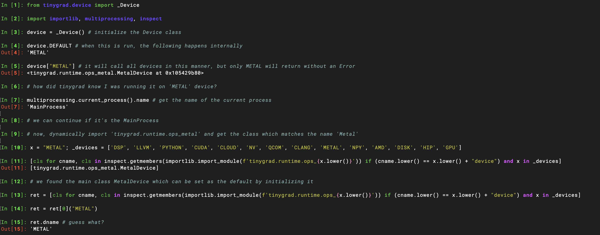

# [Device](https://github.com/tinygrad/tinygrad/blob/master/tinygrad/device.py)

## Device 
### initialization

It creates a device list by using the `runtime/ops_*` file names.
```python
_devices = ['DSP', 'LLVM', 'PYTHON', 'CUDA', 'CLOUD', 'NV', 'QCOM', 'CLANG', 'METAL', 'NPY', 'AMD', 'DISK', 'HIP', 'GPU']
```

### canonicalize

A method to standardize device strings:
'metal' => 'METAL',
'cuda:0' => 'CUDA',
'gpu:1' => 'GPU:1', etc.

If device is None, it will return `device.DEFAULT`

### DEFAULT

It checks if the device is set using an environment variable and returns that. Otherwise, it tries to find an available device using the following method:
```python
def get_available_devices(self) -> Iterator[str]:
    for device in ["METAL", "AMD", "NV", "CUDA", "QCOM", "GPU", "CLANG", "LLVM"]:
      with contextlib.suppress(Exception): yield self[device].dname
```

The device class defines `__getitem__`, which runs when `self[device]` is called. The [] notation is syntactic sugar for `__getitem__`.

`__getitem__` runs an internal function, which first gets the current process name. If it's the MainProcess, it dynamically imports the specific tinygrad.runtime.ops_{device} file. If the file contains the class named after this device, it initializes that class and returns it. For example, I use a MacBook, i.e., a METAL device.

For e.g. I use a MacBook i.e. a METAL device:

